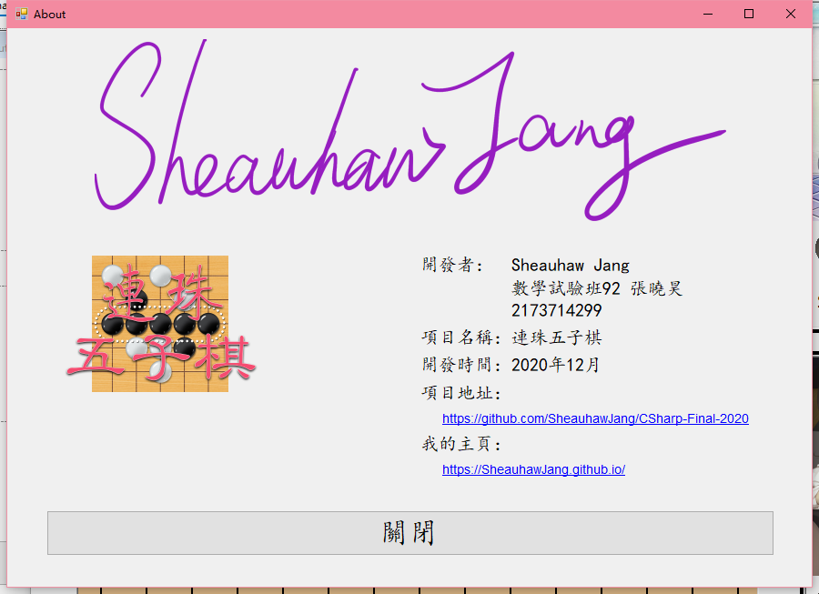

# 连珠五子棋对战程序

## 概述

开发者：Sheauhaw Jang，数学试验班92，张晓昊，学号2173714299

项目名称：连珠五子棋

本项目已经开源，源码已上传Github，地址：https://github.com/SheauhawJang/CSharp-Final-2020.

我的个人主页：https://sheauhawjang.github.io/

## 基础功能与规则

### 主界面

主界面如图所示。最左侧为棋盘，中间为角色头像与信息，最右侧为工具菜单。

### 基本流程

#### 开始对局

按下最左侧的『开始对局』即可立刻开始对局，后台将调用`Announcement.StartGame`方法，此时棋盘的用户权限打开，用户可以在棋盘中按下一个位置开始落子。黑方与白方轮流执子。

执子的一方其用户框将会变为绿色背景(`Color.SpringGreen`)，同时鼠标变为对应的棋子的形状。

按下鼠标后，距离鼠标位置最近的格点(使用`Location`类存储)将会调用`Piece.SetCheckPiece`方法放置上棋子，并显示该棋子是本局游戏的第几手落子，最后一手的数字颜色为红色，其他的为棋子的反色。同时`ContestManager.cs`中的其他类开始工作，记录用户的落子，其中每一个格点对应了一个`Location`类。如果后台记录中该点已经落子，则之后的落子都会被判定为无效。

棋子的素材放置在了Resources中，编译后将嵌入程序。

#### 结束对局

当某种颜色的棋子在一个方向上有5枚或更多的棋子连成了一线，则`Piece.SetCheckPiece`方法会检测到胜利。如果达成胜利，则会生成一个`WinningInfo`类存储信息，之后调用`Announcement.Announce`宣布胜利。检测胜利后，将会绘制一根红线将这些棋子连接，以提示用户哪里达成了胜利目标。之后弹出对话框，提示胜利者。如图所示：

如果棋盘上没有可以放置棋子的格点，则宣告平局。

检测是否有5枚或更多棋子相连的方法是在每一个格点都对应一个`ConnectInfo`类，这个类采用了并查集的思想，记录了这个格点在各个方向上与之相连的棋子的数量（下简称连数），以及两边的棋子。该数据的更新是通过封装该类的`PieceInfoSet`类中的`UpdateConnect`方法完成的。这样，判断是否连成5子只需要读取`ConnectInfo`类中的各个方向连接数即可立即判断。

### 禁手

连珠五子棋规则有禁手。禁手仅对黑方的行动产生约束。落子后，将会调用`Piece.CheckPieceRule`检查禁手。本程序中所有的禁手均按照落子无效、弹窗警告处理，而不是立即判负。本程序采用以下三种禁手：

#### 长连禁手

若黑方落子后，在一个方向上有6枚或更多的黑色棋子连成了一线，则构成了长连禁手。

判断是否连成6子或以上只需要读取`ConnectInfo`类中的各个方向连接数即可立即判断。产生长连禁手返回`-6`.

#### 四四禁手

若黑方落子后，场上同时新产生了2个或更多的『四』，包括『活四』或『冲四』，则构成了四四禁手。

判断一个组合是否为『四』，只需要检查落子点的每个方向上：端点的外侧落子是否会产生『五』，而产生『五』的充分必要条件是外侧点的外侧点(`island`)的连数与落子位置连数的和为恰为4（因为超过4会触发长连禁手）。如果新产生的『四』的数量不小于2个，则判为四四禁手。产生四四禁手返回`-44`.

#### 三三禁手

若黑方落子后，场上同时新产生了2个或更多的『活三』，则构成了三三禁手。

判断一个组合是否为『活三』，只需要检查落子点的每个方向上：端点的外侧落子是否会产生『活四』，而产生『活四』的充分必要条件是外侧点的外侧点(`island`)的连数与落子位置连数的和为恰为3（因为超过4会触发长连禁手），且`island`的另一个端点的外侧能落子，落子位置的另一个端点的外侧能落子。能落子是说该位置为空，且落子后不会产生长连禁手，即该点的外侧不是同色子。如果新产生的『活三』的数量不小于2个，则判为三三禁手。产生三三禁手返回`-33`.

|                    长连禁手                     |                           四四禁手                           |                           三三禁手                           |
| :---------------------------------------------: | :----------------------------------------------------------: | :----------------------------------------------------------: |
|  |  |  |

## 对局的高级控制

### 时间限制

在正规比赛中，会采用一种叫做棋钟的器材，选手落子后拍一下棋钟，该选手的时间不再流逝，而对手的时间开始流逝。本程序采用静态`clock`类来管理前台的两个`Timer`并实现『拍钟』效果。

对局开始时，棋钟自动调用`Start`方法开启，黑方的时间开始流逝。一方落子后，自动调用`Swap`方法拍钟，一个`Timer`停止，另一个`Timer`启动。对局结束时，棋钟自动调用`End`方法停止。随着选手对应的`Timer`的`Tick`，选手面板上的时间自动更新。

若一名选手的剩余时间变为`0`，则该选手立即被判负。每个人一局默认有3600s的思考时间，这个数字可以在设置中调整。

### 对局的其他操作

其他操作包括悔棋、认输、请求和棋。这些操作由`ToolManager.cs`管理。

#### 悔棋

选手在落子之后、对手落子之前可以申请悔棋。按下『悔棋』按钮后，程序将会跳出弹窗，并征求另一名选手的意见。若另一名选手同意悔棋的请求，则选手拍一次棋钟，恢复到落子之前的状态。

#### 认输

选手在思考落子时可以选择认输。按下『认输』按钮后，对局立即结束，认输的一方判负。

#### 请求和棋

选手在思考落子时可以选择请求和棋。按下『求和』按钮后，程序将会跳出弹窗，并征求另一名选手的意见。若另一名选手同意和棋的请求，则对局立即结束，宣告平局。

### 禁手的提示

黑方在思考落子后，按下『禁手点』按钮，屏幕上会立刻显示会导致禁手的位置，用禁止符号提醒。

### 按钮的说明

『悔棋』、『认输』、『求和』、『禁手点』按钮将在对局开始后生效，对局结束后失效。对局过程中不允许开始新的对局或读取棋谱，这两个按钮将失效，对局结束后生效。『悔棋』、『认输』、『求和』、『禁手点』按钮在菜单栏『对局』一栏中有等效的按钮。『开始对局』和『读取棋谱』按钮在菜单栏『全局』一栏中有等效的按钮。这些由静态`ButtonAccess`类控制。

## 棋谱保存与复盘

### 棋谱的保存

每个对局结束后，棋谱会自动保存在运行目录下的Records文件夹内，文件名为对局结束的时间，扩展名为record。棋谱的处理由`RecordManager.cs`中的类处理。

### 棋谱的格式

为防止棋谱文件损坏导致程序崩溃，并增加棋谱文件的易读性，棋谱文件不是按照序列化反序列化写入，而是按以下算法写入，并可以直接用文本编辑器打开。格式如下： 

第一行为程序作者的签名，属于冗余信息。 第二行为对局结束的时间（精确到秒），属于冗余信息。

第三行为对局的Base62信息，写入方式如下：

1. 对于每一手落子，设其坐标为 $(x,y)$，则其对应的Base62信息为`XY`，其中`X`对应 $x$ 的Base62值，`Y`对应 $y$ 的Base62值。将每一手落子按顺序将其Base62信息拼接。
2. 拼接一个`F`表示落子记录写入完毕。`F`代表棋盘的大小，这保证了`F`不会在更早的地方出现。
3. 存储宣告胜利的`WinningInfo`信息。若`WinningInfo.Winner`的值为`0`或`1`，则分别代表黑方和白方胜利，直接将这个值拼接。否则视为平局，拼接`F`。`WinningInfo.WinWay`表示对局的备注信息，将其中的每个字符串依次按二进制低位到高位存储。

第四行和第五行为第三行信息的`Hash`值，进制数分别为 $998244353,1000000007$，同余模数为 $19260817$。

第六行为第三行信息作为十六进制数对应的十进制数，使用`System.Numerics.BigInteger`类处理，需要在引用文件中添加`System.Numerics`. 第七行和第八行为第六行信息的`Hash`值。

之后为信息的明文存储，对棋谱的读取无作用，仅供预览使用。

### 棋谱的读取

打开棋谱文件后，读入第三行的Base62信息，并将其与后五行的信息对比。若均匹配，则说明文件没有损坏（或经过了全面地损坏），将其中的信息按Base62信息的写入方法反向写入一个`Record`类，其中有落子顺序和宣告胜利信息。

### 棋谱的回放

#### 开始回放

按下最左侧的『读取牌谱』即可开始牌谱的回放。按下按钮后会弹出对话框选择棋谱，之后读取选择的棋谱。若棋谱的读取出现错误（例如hash值不匹配等），则告知文件损坏，不能回放。否则将读取的`Record`类作为参数调用`Replayer.ReplayStart`方法开始回放。

回放过程与对局过程类似，不过用户没有操作棋盘的权限，同时棋钟也不会开启，回放结束后不保存棋谱。落子的操作将交由静态`Replayer`类托管，每隔300ms落一个子，时间间隔可以在设置中调整。

#### 暂停回放

有两种方法暂停当前的回放：双击棋盘和在菜单栏『对局』一栏中点击『暂停/恢复播放』按钮。按钮将在开始回放时生效，回放结束后失效。再次进行上述操作恢复播放。

#### 结束播放

若棋谱回放完毕，则回放自动结束。可以在菜单栏『对局』一栏中点击『中止播放』按钮提前结束播放。

## 全局变量配置

### 窗体界面

点击『对局配置』即可对游戏环境进行配置。在如下窗体(`ConfigForm`)中配置：

### 用户信息配置

左侧两栏是对用户信息的配置，可以自由配置用户的用户名和头像，并显示在主界面。图中的头像是默认头像。若留空对应的栏目，则意味着使用默认的用户名或头像。头像的比例是 $5:6$，各处头像会自动聚焦，主界面的头像大小是 $200\times240$，人机托管按钮的头像大小是 $100\times 120$. 按下恢复默认可以恢复默认头像。

### 环境变量配置

右侧是环境变量的配置，可以调整思考时间、语言、回放延迟、音乐音效、AI延迟等。思考时间的范围是 $1$ 到 $359999$, 单位是s，延迟时间的范围是 $1$ 到 $10000$, 单位是ms。

### 提交修改与取消修改

如果要应用更改，点击『提交』按钮即可，修改立即生效。如果要取消在本界面做的修改，点击重置即可恢复到刚打开时的状态。点击取消则窗体关闭无事发生。

## 音乐系统

音乐的处理由`MusicManager.cs`中的类处理。

### 背景音乐

共计有三个背景音乐，由静态`BGM`类管理。对局未开始时，背景音乐为锣鼓喧天的欢迎音乐。对局开始后，背景音乐变为悠闲的对局音乐。若对局中出现了『四』，则背景音乐变为激烈的战斗音乐，且播放完毕后变回对局音乐。对局结束后，背景音乐恢复至欢迎音乐。音乐取材自欢乐斗地主。

### 音效

有落子音效和胜利音效，由静态`SoundE`类管理。落子音效是在用户落子后发出。胜利音效是达成五子连线的时候发出。

### 音频文件管理

音频文件使用内置`System.Windows.Media.MediaPlayer`类读取，并由其的实例播放音频。该类可以同时播放多个音乐，但是不能循环播放。通过赋予对象`MediaEnded`事件使其在播放结束后位置回归起点来实现循环播放。使用该类需要在引用文件中添加`PresentationCore`.

## 多语言管理系统

由于考虑到五子棋是一个国际化的休闲娱乐活动，而现行的连珠规则起源于日本，故在语言中添加了English和日本語的选项，可以在设置中调整。实现方法为所有的字符串交由`Localisation.resx`文件管理，根据用户设定的地区，从不同地区对应的文件中查找，并返回不同的字符串。`Localisation.resx`存储简体中文翻译，`Localisation.en-US.resx`存储英文的翻译，`Localisation.ja-JP.resx` 存储日文的翻译, `Localisation.zh-TW.resx`存储繁体中文的翻译。部分界面中的文字需要重写`MainForm`的`Load`事件修改文字。

|                           English                            |                            日本語                            |                           繁體中文                           |
| :----------------------------------------------------------: | :----------------------------------------------------------: | :----------------------------------------------------------: |
|  |  |  |

## 人机对战功能

### 开启人机对战

在开始对局的下方，有两个由用户头像和浮动图片组成的按钮，分别代表了两个选手的人机状态。若浮动图片是大脑，则代表着是人类玩家。若浮动图片是电脑，则代表着是低级AI。若浮动图片是带闪电的电脑，则代表着是高级AI。可以点击按钮切换人机状态。

### 人机对战算法

人机对战由`AIManager.cs`管理。

#### 基本算法

基本算法是Maxmin算法，加Alpha-Beta剪枝。这个算法是构建了一个决策树，Max层是思考者，Min层是思考者的对手。Max层的选手将会选取价值最大的选择方案，Min层的选手将会选取价值最低的方案。决策树和搜索由静态`SearchTree`类管理。

#### 决策树剪枝

直接搜索决策树复杂度较大，于是考虑剪枝：采用Alpha-Beta剪枝算法，$\alpha$ 表示选择的上界，$\beta$ 表示选择的下界，每次计算一个决策树分支后，更新 $\alpha,\beta$ 的值。若 $\alpha\le\beta$, 则之后的分支一定不会被选择，这样就降低了搜索的情况数。

除此之外，决策树中考虑的点并不是全屏中的点，而是附近有子的空点，具体地说，就是沿着某一个方向走至多两步能遇到棋子的点。除此之外的点是沉睡的，不会被AI考虑。而有些条件下，可选的点的条件就更苛刻：若落在某处可以构成『五』，则显然这个点是最优的，其他的所有点都不考虑；若空着的点可以被对方落子构成『五』，则可选的方案也只有堵住这个『四』，其他不堵这个『四』的方案都不予选择。

#### 估价函数

Minmax算法需要有一个估价函数，由`Envalue`类管理，这个函数在这里是按照下述方法定义的：

1. 有我的『五』，估价为 $2^{50}$.
2. 有对方的『五』，估价为 $-2^{50}$
3. 有对方的『活四』，或有对方的两个『四』，估价为 $-2^{40}$
4. 有自己的『活四』，或有自己的两个『活四』，估价为 $2^{40}$

以上四条，均是直接计算得到答案，不叠加。同时满足取最先满足的。若以上都不满足，则初始估价为 $0$, 按以下方法叠加：

1. 每有一个『四』，估价 $2^{12}$, 若这个结构是对方的，则该结构本身的估价 $\times(-2)$.
2. 每有一个『双活三』, 估价 $2^{10}$, 若这个结构是对方的，则该结构本身的估价 $\times(-2)$.
3. 每有一个『坎活三』, 估价 $2^{8}$, 若这个结构是对方的，则该结构本身的估价 $\times(-2)$.
4. 每有一个『冲三』, 估价 $2^6$, 若这个结构是对方的，则该结构本身的估价 $\times(-2)$.
5. 每有一个『双活二』, 估价 $2^4$, 若这个结构是对方的，则该结构本身的估价 $\times(-2)$.
6. 每有一个『坎活三』, 估价 $4$, 若这个结构是对方的，则该结构本身的估价 $\times(-2)$.
7. 每有一个『冲二』, 估价 $1$, 若这个结构是对方的，则该结构本身的估价 $\times(-2)$.

#### 决策树深度

考虑到运行时间的问题，初级AI的迭代深度为2层，平均1s即可得出选择，水平可以比拟正常打法的人类玩家；高级AI的迭代深度为3层，平均10s之内即可得出选择，水平较高。

### 多线程并行

直接在主线程进行计算会导致程序在计算过程中没有响应，棋钟也不会正常运行，落子信息不能即时反馈，严重影响游戏体验。对此的解决方案为：使用`AITimer`定期检查是否到AI执子，若轮到AI执子，则先新建线程进行计算，并将该线程托管给静态`BackCalculate`类，该类会在线程消亡后存储线程的信息，存储方法是将`Location`类封装成`AnswerSaver`类，并令线程调用`AnswerSaver`类实例的`Get`方法计算答案并存储在`Ans`方法中。之后`AITimer`定期检查线程是否消亡，消亡则立即取出答案落子，并销毁线程。这样就做到了并行计算。

## 关于界面

点击菜单栏的『关于』按钮即可查看关于界面。

